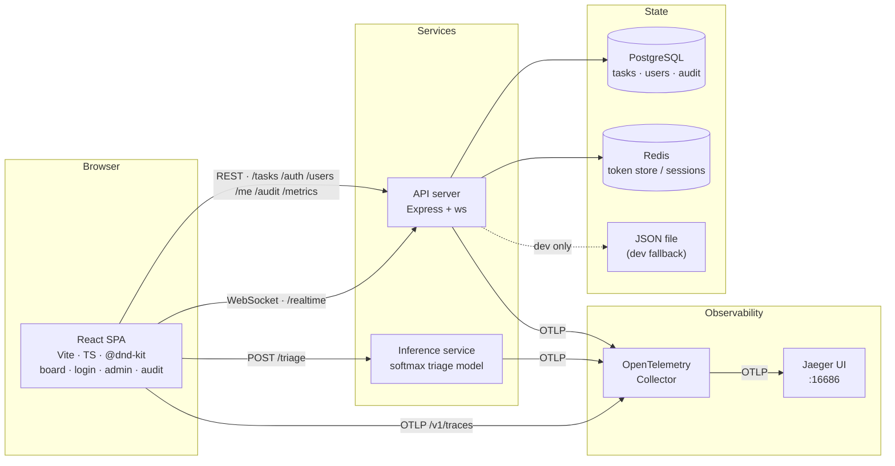
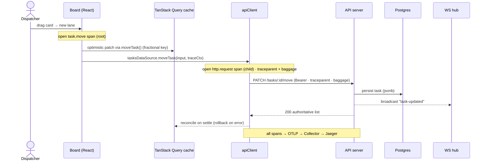
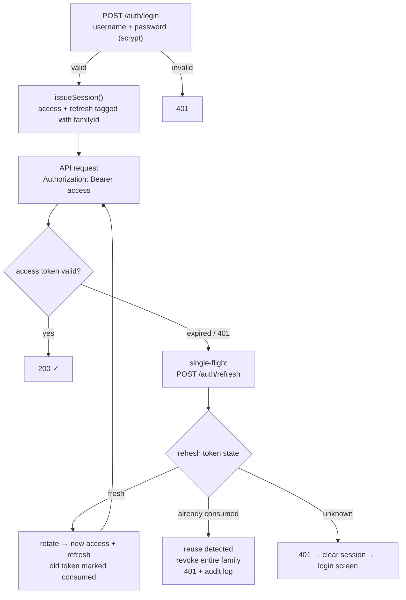
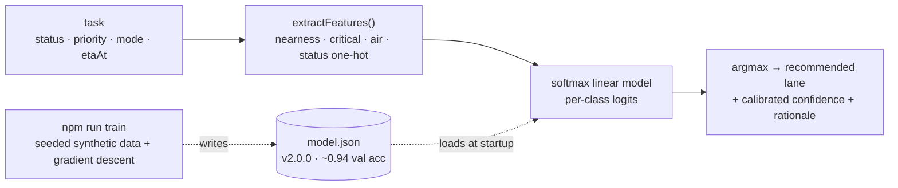
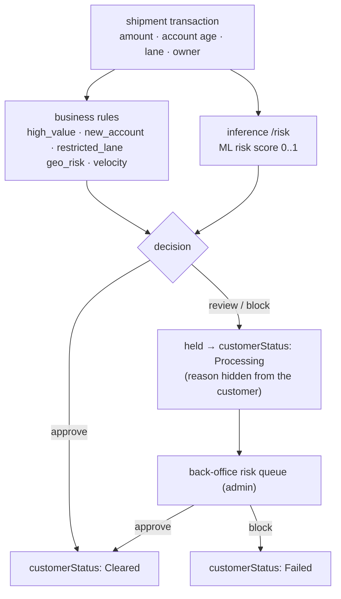
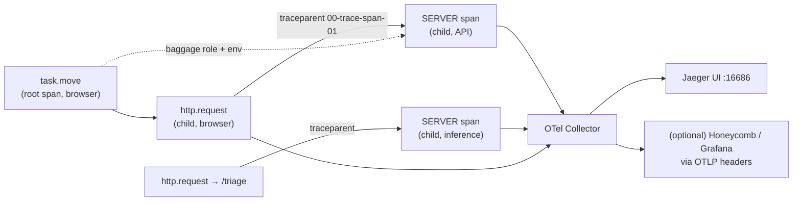
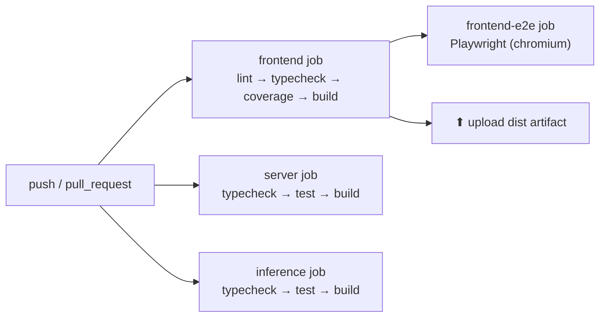
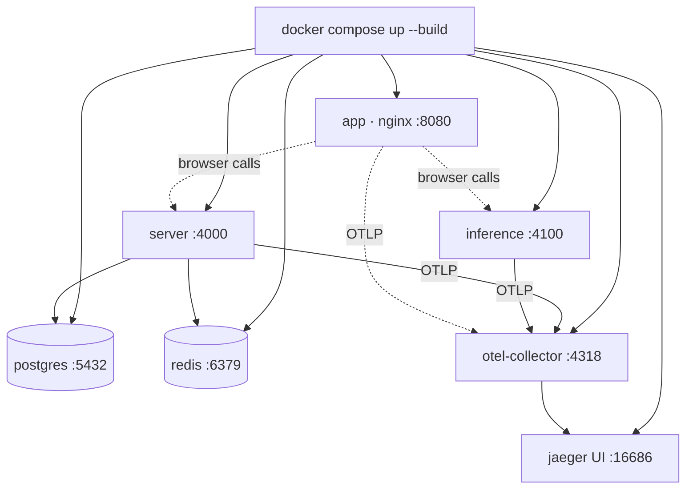

<div align="center">

# Shiptivitas — Logistics Control Tower

**A real-time, AI-assisted shipping operations platform — rebuilt from a 2019 take-home into a production-shaped, fully-observable multi-service system.**


</div>

---

## At a glance

| | |
|---|---|
| **Services** | `app/` (React SPA) · `server/` (API) · `inference/` (ML triage) |
| **Source** | ~131 TypeScript files · ~7,100 LOC (strict mode) |
| **Tests** | **147 passing** — 81 frontend · 54 server · 12 inference |
| **Frontend bundle** | 90.29 KB gzipped JS · 3.92 KB gzipped CSS |
| **Quality gates** | lint ✓ · strict typecheck ✓ · build ✓ · e2e ✓ — all green |
| **Run it** | `docker compose up --build` → app `:8080`, traces in Jaeger `:16686` |
| **Origin** | `shiptivitas-1-master/` (the original CRA take-home, kept untouched as a reference) |

---

## The story (STAR)

### Situation
The starting point — preserved in [`shiptivitas-1-master/`](shiptivitas-1-master) — was a 2019-era **Create React App** take-home from the "Work at a YC Startup" virtual experience. It showed shipping requests as a flat list, glued together with **jQuery + Bootstrap + Dragula**, with **no TypeScript, no tests, and no backend**. It also shipped three latent defects: a `Board.js` that imported Dragula but never initialised it, a drop handler that re-rendered React *on top of* Dragula's mutated DOM (the classic duplicate-card bug), and `<style jsx>` (a Next.js feature) that never compiles under CRA. In short: a toy, not a system.

### Task
Elevate it into a **production-grade logistics operations platform** — a real-time operational dashboard that handles high-frequency state updates, secure multi-role auth, end-to-end observability, and an intelligent ML layer — architected so it is decoupled and resilient enough to scale into an enterprise ecosystem.

### Action
A staged, **test-driven** rebuild delivered as a clean multi-service monorepo. Each phase was verified green (lint · typecheck · unit/integration tests · build · live smoke) before the next began:

1. **Foundation** — Vite + strict TypeScript; **@dnd-kit** replacing Dragula; **TanStack Query** (server state) + **Zustand** (UI state); a *pure, framework-free* domain core.
2. **Scale & UX** — **fractional indexing** (a move rewrites one row, not the lane), **virtualized lanes**, memoised rendering, optimistic updates with rollback.
3. **Realtime & AI** — a reconnecting **WebSocket** channel; **AI triage** as a swappable `TasksDataSource`.
4. **Backend** — **Express + ws**, **Postgres / JSON** persistence behind one interface, authoritative move logic, realtime broadcasts.
5. **Security** — login + **roles**, bearer tokens with **refresh-token rotation**, **reuse-breach detection**, scrypt-hashed users, an admin console + **self-service** password change.
6. **Observability** — client + server **OpenTelemetry** spans, **W3C `traceparent`** parent/child linkage, **`baggage`** propagation, **head sampling**, **Prometheus** metrics, and an **OTLP → Jaeger / Honeycomb** export path.
7. **Intelligence** — a standalone **inference service** running a **trained** softmax model loaded from a versioned `model.json` artifact.
8. **Operations** — a full **docker-compose** stack (app + API + inference + Postgres + Redis + OTel Collector + Jaeger) and a **4-job CI** pipeline.

### Result
A coherent, runnable full stack: **3 services**, **~7,100 lines of strict TypeScript**, **147 automated tests**, all gates green, and **one-command** local bring-up. Beyond unit/integration coverage, every critical path was confirmed with **live smoke tests** — refresh-token breach revocation, distributed traces landing in Jaeger, Prometheus token metrics, and baggage flowing from browser to backend spans. The architecture is decoupled at exactly the seams that matter (data source, token store, triage model, trace exporter), so each can be swapped without touching the UI.

---

## System architecture



**Why it's shaped this way.** Every cross-service boundary is an interface, so implementations are swappable: `TasksDataSource` (mock ⇄ HTTP), `TokenStore` (in-memory ⇄ Redis), `TaskStore`/`UserStore`/`AuditLog` (JSON ⇄ Postgres), `TriageModel` (heuristic ⇄ trained service), and the OTLP exporter (Collector ⇄ any hosted vendor). The frontend never knows which is wired in.

---

## Optimistic move — request data flow

The single most important interaction (drag a card to a new lane) is optimistic, traced end-to-end, and reconciled against the server:



---

## Authentication & session lifecycle



Roles gate the admin surfaces (`requireRole('admin')`), and `/metrics` exposes token issue / reuse / eviction counters for monitoring.

---

## AI triage pipeline



The model is a *real artifact*: weights are trained by `inference/scripts/train.ts` (reusing the service's own feature extraction — no train/serve skew) and shipped as `model.json`. Swap the file to ship new weights with zero code changes; point the client's `VITE_TRIAGE_URL` at any compatible endpoint.

---

## Transaction risk & the dual view

Every shipment carries a **transaction**. A risk engine combines deterministic
business rules with an ML risk score (from the inference service) into an
**approve / review / block** decision — and the platform shows a different
picture to each audience: the **customer sees a clean status**, while the **back
office sees the full risk and a review queue**.



| | Customer view | Back-office (admin) view |
|---|---|---|
| **Shipments shown** | only your own | every shipment |
| **Status** | Pending / Processing / Cleared / Failed | same |
| **Amount** | visible | visible |
| **ML risk score** | hidden | visible |
| **Fired rules / reason** | hidden | visible |
| **Decision + review queue** | hidden | visible, with Approve / Block |

Three roles see three pictures, all enforced **server-side** in `GET /tasks`:
a **customer** sees only the shipments they own with risk fields stripped; a
**dispatcher** (ops) sees every shipment but no risk internals; an **admin** sees
every shipment plus the full risk and the review queue. Ownership is checked on
mutations too — a customer can only move their own shipments (`403` otherwise).

The rule set spans the transaction itself (`high_value`, `new_account`,
`restricted_lane`) and richer behavioural / geographic signals: **`geo_risk`**
(origin or destination on the enhanced due-diligence list) and **`velocity`** (an
owner exceeding a rolling 24-hour shipment threshold). Customers self-**signup**
(role `customer`); the back office reviews flagged transactions from the admin
**Risk** panel.

## Distributed tracing



One drag becomes **one distributed trace**: the browser `task.move` span is the root, the HTTP call is its child, and the server emits a true child span via the inbound `traceparent`. Traces are head-sampled (deterministic, consistent across services) and enriched with W3C `baggage`.

---

## CI/CD & build pipeline





---

## Tech stack

| Layer | Choices |
|---|---|
| **Frontend** | Vite 8 · React 18 · TypeScript (strict) · @dnd-kit · TanStack Query · Zustand · Tailwind · @tanstack/react-virtual · oxlint |
| **Testing** | Vitest · React Testing Library · Playwright (e2e) · supertest · pg-mem · ioredis-mock |
| **Backend** | Node 22 · Express 4 · ws · pg (Postgres) · ioredis (Redis) · `node:crypto` scrypt |
| **Inference** | Node 22 · Express · custom softmax model (trained weights) |
| **Observability** | OpenTelemetry (OTLP/HTTP) · W3C traceparent + baggage · Prometheus metrics · Jaeger |
| **Ops** | Docker (multi-stage) · docker-compose · nginx · GitHub Actions |

---

## Feature journey

The system was grown in verified increments — each row was lint/typecheck/test/build-green before moving on:

| Phase | Delivered | Verified by |
|---|---|---|
| **L1 — Foundation** | Vite+TS app, @dnd-kit board, pure domain core, optimistic `useMoveTask` | RTL + unit tests |
| **L2 — Scale** | fractional indexing, virtualized lanes, memoisation | property test (500 random inserts) |
| **L3 — Realtime/AI** | reconnecting WebSocket, AI triage data source | fake-socket + fake-timer tests |
| **Backend** | Express+ws, Postgres/JSON `TaskStore`, realtime broadcasts | supertest + pg-mem |
| **Auth** | login, token refresh, rotation, **reuse-breach detection**, roles | unit + route + live smoke |
| **Users/Account** | admin users CRUD + roles UI, self-service password change | RTL + supertest |
| **Observability** | client+server OTLP, traceparent parent/child, baggage, sampling | unit + live collector smoke |
| **Inference** | standalone service + **trained** model artifact | model behaviour tests |
| **Infra** | Redis token store, audit log, Prometheus `/metrics`, Jaeger + hosted exporter | ioredis-mock + live smoke |

---

## Verification & results

Every claim below is reproducible from the delivered code. These are the actual gate outputs.

**Test suites — 147 passing**

```text
app/        Test Files  25 passed (25)   Tests  81 passed (81)
server/     Test Files  13 passed (13)   Tests  54 passed (54)
inference/  Test Files   3 passed (3)    Tests  12 passed (12)
```

**Frontend production build**

```text
dist/index.html                 0.48 kB │ gzip:  0.32 kB
dist/assets/index-*.css        15.13 kB │ gzip:  3.92 kB
dist/assets/index-*.js        285.70 kB │ gzip: 90.29 kB
✓ built in ~0.7s
```

**Quality gates** — `lint ✓ (oxlint, 0 warnings/errors)` · `app/server/inference typecheck ✓ (strict)` · `server/inference tsc build → dist ✓`

**Live smoke — refresh-token reuse / breach detection**

```text
rotate R0 -> R1 (R1 set: yes)
reuse R0 (expect 401):                              401
rotated R1 after breach (expect 401, family revoked): 401
breach logged:  auth.refresh.reuse
```

**Live smoke — Prometheus token metrics (`GET /metrics`)**

```text
# before login
shiptivitas_tokens_issued_total 0
# after one login
shiptivitas_tokens_issued_total 1
shiptivitas_tokens_active_refresh 1
```

**Live smoke — distributed trace + baggage at the collector**

```text
COLLECTOR span parentSpanId= bbbbbbbbbbbbbbbb traceId= aaaaaaaaaaaaaaaaaaaaaaaaaaaaaaaa
BATCH1 spans=25 firstKeys=["http.method","http.route","http.status_code",
                           "baggage.enduser.role","baggage.deployment.environment"]
```

**Live smoke — admin audit log**

```text
audit entry: actor=service action=user.create target=smoketest
```

---

## Getting started

### Option A — full stack with Docker (recommended)

```bash
docker compose up --build
```

| URL | What |
|---|---|
| http://localhost:8080 | the app (sign in: `admin` / `admin-password` for the admin console, or `dispatcher` / `dev-password`) |
| http://localhost:4000 | API server (Postgres + Redis backed) |
| http://localhost:4100 | inference service |
| http://localhost:16686 | **Jaeger** — watch a drag become a distributed trace |

### Option B — frontend only (in-memory mock, no backend)

```bash
cd app && npm install && npm run dev      # http://localhost:5173
```

### Option C — run each service locally

```bash
cd inference && npm install && npm run dev   # :4100
cd server    && npm install && npm run dev   # :4000
cd app && npm install && cp .env.example .env # set VITE_USE_MOCK=false
npm run dev                                   # :5173
```

Per-service docs: [`app/README.md`](app/README.md) · [`server/README.md`](server/README.md) · [`inference/README.md`](inference/README.md).

---

## Project structure

```text
Frontend-Shipping-Task-Manager/
├── app/                      # React + Vite frontend (81 tests)
│   └── src/
│       ├── lib/              # apiClient · telemetry · otlpExporter · baggage · queryClient
│       └── features/
│           ├── auth/         # login · refresh · roles
│           ├── users/        # admin users CRUD UI
│           ├── account/      # self-service password
│           ├── audit/        # audit filter UI
│           ├── observability/# dev Trace panel
│           └── board/        # pure domain core · dnd · ai · api · hooks · components
├── server/                   # Express + ws API (54 tests)
│   └── src/
│       ├── auth/             # tokenService · tokenStore(memory|redis) · users · scrypt
│       ├── store/            # TaskStore (json | postgres)
│       ├── audit/ · metrics/ · telemetry/ · routes/ · middleware/ · domain/
├── inference/                # ML triage service (12 tests)
│   ├── model.json            # trained weights artifact
│   └── src/model/ + scripts/train.ts
├── docker-compose.yml        # app + server + inference + postgres + redis + collector + jaeger
├── otel-collector-config.yaml
├── .github/workflows/ci.yml  # 4 jobs
└── shiptivitas-1-master/     # the original 2019 take-home (reference)
```

---

## License & credits

Built by **[Tagore Nand Vardhan Seeram](https://github.com/TagoreNand)**. The original scaffold is the open-source [insidesherpa/shiptivitas-1](https://github.com/insidesherpa/shiptivitas-1) (Forage / YC virtual experience) — educational use. This rebuild extends it into an original, production-shaped reference architecture.
